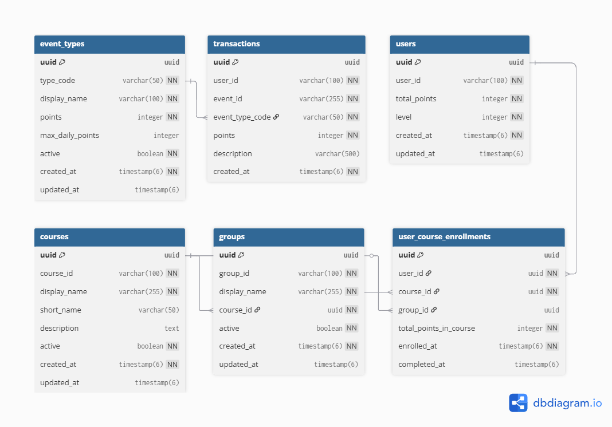

# Геймификация образовательного процесса в LMS

[](https://coveralls.io/github/cptntotoro/lms-gamification?branch=main)

[](https://openjdk.org/projects/jdk/21/)
[](https://spring.io/projects/spring-boot)
[](https://www.postgresql.org/)
[](LICENSE)

**НИР:** «Исследование архитектурных подходов и проектирование серверного модуля геймификации для интеграции с
российскими LMS платформами»

**Цель исследования:**  
Исследование архитектурных подходов и технологий real-time обновлений, а также разработка концепции серверного
backend-модуля геймификации для интеграции с российскими LMS-платформами

## Основные результаты НИР (на 19 февраля 2026)

- Реализована серверная часть системы начисления очков и уровней с защитой от дублирования событий
- Введена модель настраиваемых типов событий (`EventType`) с возможностью задания количества очков, дневных лимитов и
  состояния активности
- Обеспечена транзакционная целостность и атомарность операций
- Добавлена защита от нарушения внешних ключей между транзакциями и типами событий
- Реализованы административные сервисы для управления типами событий (CRUD)
- Обновлены репозитории и тесты с учётом новых полей и ограничений БД
- Разработан административный интерфейс для мониторинга данных (частично)

## Архитектура (на февраль 2026)

```text
[ LMS / внешние системы ]
↓ (webhook / API, LmsEventRequestDto)
[ REST API ]  ← Spring Boot Controllers
↓
[ Service Layer ]
├── UserService               (создание/обновление пользователей)
├── TransactionService        (транзакции + защита от дублей по eventId)
├── EventManagementService    (оркестрация обработки событий от LMS)
├── EventTypeService          (поиск активных типов, проверка лимитов)
├── EventTypeAdminService     (админ CRUD для типов событий)
↓
[ Repository Layer ]  ← Spring Data JPA
↓
[ PostgreSQL ]
├── users
├── transactions              (event_type_code → FK → event_types.type_code)
└── event_types               (настраиваемые типы событий)
```

Основные защитные механизмы:

- Уникальность event_id в transactions → защита от повторного начисления
- Внешний ключ event_type_code → event_types.type_code → целостность данных
- Транзакционность всех операций (@Transactional)
- Валидация входящих данных (@Valid + Bean Validation)
- Проверка дневных лимитов по типу события (EventType.maxDailyPoints)
- Разделение пользовательских и административных сервисов

## Запуск проекта

### Требования

- JDK 21+
- PostgreSQL 17+
- Maven 3.9+

### Локальный запуск

1. Создайте базу данных:

```sql
CREATE DATABASE gamification;
```

2. Настройте application.yml или используйте переменные окружения

3. Запуск:

```shell
mvn spring-boot:run
```

Или через IDE: запустить класс GamificationApplication

### Основные эндпоинты (на текущий момент)

| Метод  | Путь                                   | Описание                        | Доступ |
|--------|----------------------------------------|---------------------------------|--------|
| POST   | /api/events                            | Обработка события из LMS        | LMS    |
| GET    | /api/admin/event-types                 | Список всех типов событий       | ADMIN  |
| POST   | /api/admin/event-types                 | Создание нового типа события    | ADMIN  |
| GET    | /api/admin/event-types/{id}            | /api/admin/event-types/{id}     | ADMIN  |
| PUT    | /api/admin/event-types/{id}            | /api/admin/event-types/{id}     | ADMIN  |
| DELETE | /api/admin/event-types/{id}            | /api/admin/event-types/{id}     | ADMIN  |
| GET    | /api/admin/users/{userId}/transactions | История транзакций пользователя | ADMIN  |
| GET    | /api/admin/users                       | Список всех пользователей       | ADMIN  |

### Документация API

Swagger UI доступен по адресу:

```text
http://localhost:8080/swagger-ui.html
```

OpenAPI спецификация:

```text
http://localhost:8080/v3/api-docs
```

### Cхема БД



### Тестирование

Запуск всех тестов

```
mvn test
```